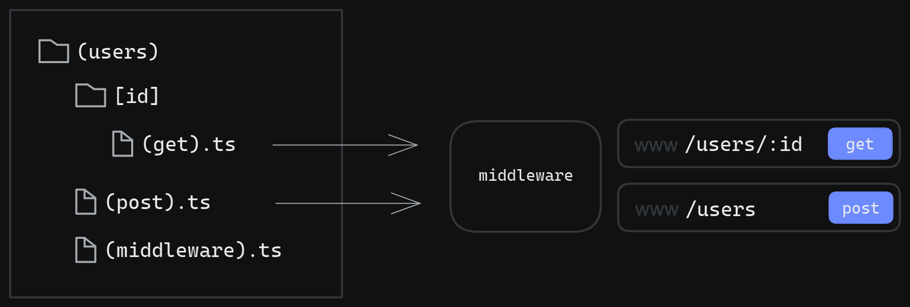

This is very experimental **DO NOT** use it in production.

# What is Atom

Atom is a simple robust web framework built with Deno. Many features are inspired by front-end frameworks like React and Next.js such as the file-based routing and hooks.

This is not a complete documentation because the framework is still in development. I will update this document as the framework evolves.
# Routing

## Basics

Routing is file-based meaning that each folder represents a route segment. Each folder should be wrapped within parentheses `()`. This is delibrate design choice so that you can colocate your own folders within your routes without any conflict.

The files within a route should be named after an HTTP verb such as `get` or `post` and should also be wrapped within parentheses `()`.

Look at the example below:


## Route handler

Each file should have one **default export** which is a function that takes the request as a parameter and returns a response. The parameter is an instance of `Request` and the return value should be an instance of `Response`

```js
// -> /(get).ts
import { RequestHandler } from "atom";

const Home: RequestHandler = (request: Request) => {
  return new Response(`Hello world, your url is ${request.url}`);
};

export default Home;
```

The route handler is as simple as a function that takes a request and returns a response.

Note that the parameter type annotation is only written for explanation. It is not needed since we have already have a built in type for route handlers.

## Dynamic Parameters
You can define dynamic parameters the same way you define routes but instead of wrapping the folder name with parentheses `()`, you have to wrap it within brackets `[]`


You can access the parameters using a hooks called `useParams`. The difference between hooks and regular functions is that hooks usually have implicit access to the request object. That makes hooks very handy and powerful.

```js
// -> /users/[id]/(get).ts
import { HttpStatus, useParams } from "atom";

export default function getUsers(): Response {
  const params = useParams();

  return new Response(`Getting user ${params.id}`, {
    status: HttpStatus.OK,
  });
}
```

## Route Group

**Not implemented yet**

You can create a folder that starts with `@` to group routes together without affecting the url


## Middlewares

You can define a middleware by creating a file called `(middleware).ts`. Middlewares are nested meaning that if you define a middleware for `/users` it will also run when requesting `/user/:id` 



To prevent a request from completing its destination just return a response. It is as simple as that.

```js
// -> /routes/(middleware).ts
import { MiddlewareHandler } from "atom";

const homeMiddleware: MiddlewareHandler = (req) => {
  const pathname = new URL(req.url).search;
  const age = new URLSearchParams(pathname).get("age");
  if (!age || +age < 18) {
    return new Response("You are under 18");
  }
};

export default homeMiddleware;
```

You can also apply some middleware to a specific end-point by exporting an array of middlewares

```js
// -> /routes/(get).ts
import { RequestHandler } from "atom";

const Home: RequestHandler = (req: Request) => {
  return new Response(`Hello world, your url is ${req.url}`);
};

export const middlewares = [middleware1, middleware2]

export default Home;
```

These middlewares will only apply to get requests at `/`
